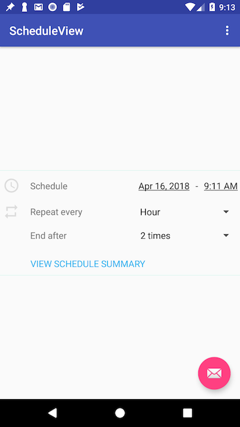
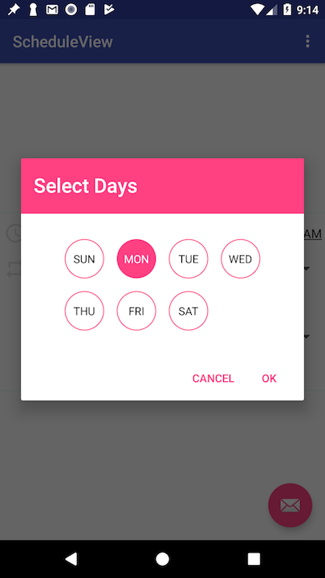

# ScheduleView
A schedule view with date, time, repeat type, repeat day, number of repetitions options. 



## Download 

```
implementation 'io.github.informramiz:scheduleviewlibrary:1.0'
```

## Getting Started

Setting info is very simple using the Builder class provided.

### XML

```
<com.github.informramiz.scheduleviewlibrary.PostScheduleView
        android:id="@+id/post_schedule_view"
        android:layout_width="match_parent"
        android:layout_height="wrap_content"/>
```

### Java

```
PostScheduleView postScheduleView = findViewById(R.id.post_schedule_view);

//initialize post schedule view with custom data
PostScheduleView.PostScheduleInfo postScheduleInfo = new PostScheduleView.PostScheduleInfo.Builder()
                .setRepeatType(Post.HOURLY)
                .setRepeatCount(2)
                .setRepeatForever(false)
                .setPostScheduleDate(Calendar.getInstance().getTimeInMillis())
                .build();
postScheduleView.setScheduleInfo(postScheduleInfo);
```

And same is for getting the schedule info.

```
//after user is done, get the info with a simple method call
PostScheduleView.PostScheduleInfo postScheduleInfo = postScheduleView.getScheduleInfo();
```